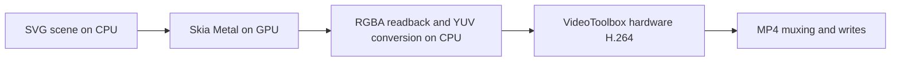

# fframes + Skia vs Remotion

```sh
./render-bench/vs-remotion/run.sh
```

Requires Rust, Node.js and Chromium (`CHROME_PATH` or `--chrome PATH`).
Results and frame PNGs go to `out/`; use `--out DIR` to choose a directory.

One fixed 1000×1000 scene: 20 animated panels containing 99,000 overlapping
16–28px rectangles and 1,000 changing text digits. Each panel has a blurred
glow, color saturation and a soft drop shadow; text is painted last.
Both use DM Sans Regular from `examples/beta/media/DMSans-Regular.ttf`.
Remotion uses an unkeyed list with 12 dependent effect/state updates per element.
fframes computes the same content directly with Skia CPU and, when available,
Skia GPU (Metal on macOS, Vulkan elsewhere). GPU is skipped without a hardware device.
Results apply to this React workload with many effects.
Both Skia backends use 100,000-entry SVG text and geometry caches, with a
51.2 MB geometry budget per generation. Limits come from `SkiaCacheConfig`.

All use one rendering pipeline. Render-to-PNG times are medians of three 30-frame
runs after three warm-up frames. PNG compression is included; video encoding,
startup, warm-up and disk writes are excluded.

The runner writes timings and versions to `results.json`, with a summary in
`results.md`. Generated results and dependency lockfiles are ignored.

Apple M5 Max medians with the previous default cache limits, Remotion 4.0.529:

| Renderer                   | Render-to-PNG, 30 frames | Speedup vs Remotion |
| -------------------------- | -----------------------: | ------------------: |
| fframes + Skia CPU         |                  5.794 s |              17.70× |
| fframes + Skia GPU (Metal) |                  2.896 s |              35.42× |
| Remotion                   |                102.580 s |                   — |

The same entry point measures standalone encoding and complete MP4 export.
H.264 settings: 30 frames at 30 fps, 8 Mbps target, GOP 30, yuv420p, no audio.
On macOS, Skia GPU and Remotion use hardware VideoToolbox; CPU uses x264 medium.
Elsewhere all use x264 medium. Each uses one codec thread. Encoder failures are
reported rather than silently falling back.

Standalone encoding includes RGBA conversion (fframes) or PNG decoding (Remotion),
setup, flushing and writes. Complete export measures each framework's overlapping
render/encode/mux pipeline directly. Browser launch and bundling are excluded.
Matching target bitrates do not guarantee matching image quality.

| Renderer                   | Encoder               | Prepared-frame encoding | Complete MP4 export |
| -------------------------- | --------------------- | ----------------------: | ------------------: |
| fframes + Skia CPU         | x264 medium           |                 1.343 s |             5.818 s |
| fframes + Skia GPU (Metal) | VideoToolbox hardware |                 0.146 s |             1.609 s |
| Remotion                   | VideoToolbox hardware |                 0.335 s |           100.152 s |

GPU complete export is 62.26× faster than Remotion on this workload.


